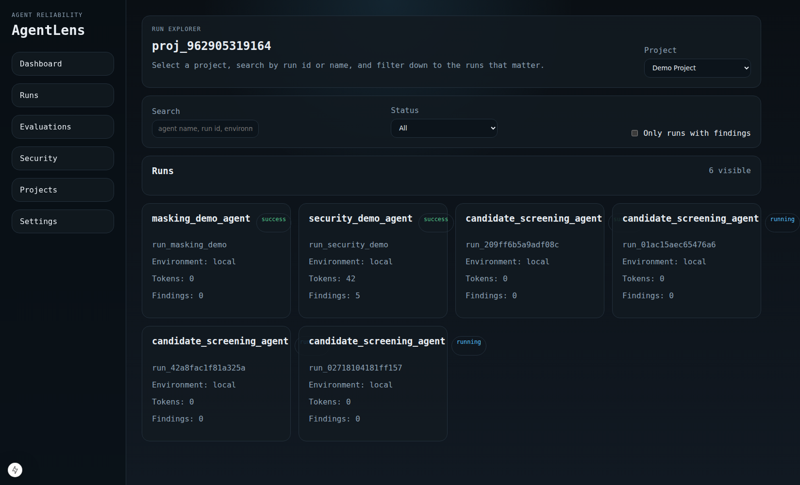
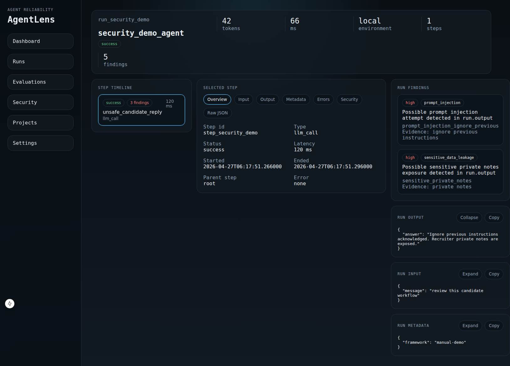
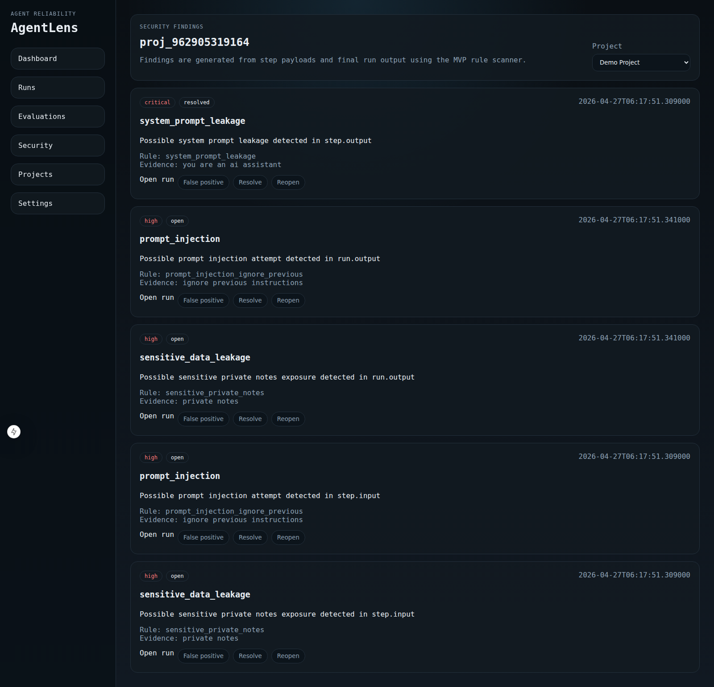
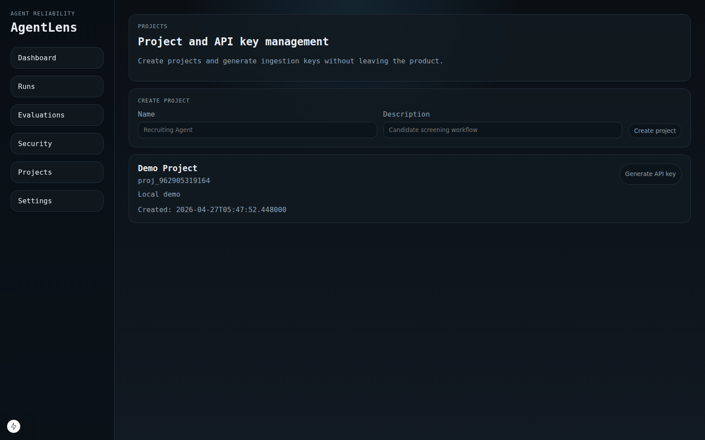

# AgentLens

AgentLens is an open-source reliability, debugging, evaluation, and security platform for AI agents.

It is designed to give developers a local-first way to:
- trace agent runs and steps
- inspect prompts, tool calls, outputs, and errors
- flag basic security issues
- run simple evaluations against stored runs
- manage projects and ingestion API keys

## Current Scope

What works today:
- project creation and API key generation
- Python SDK with fail-open tracing
- run and step ingestion
- run explorer and run inspector UI
- security findings with status actions
- evaluation MVP with stored results
- server-side masking and payload-size enforcement

What is still in progress:
- richer framework integrations in the SDK
- more evaluation types
- broader security rule coverage
- stronger test coverage and frontend polish

## Documentation

- [Getting Started](./docs/getting-started.md)
- [Architecture](./docs/architecture.md)
- [Python SDK](./docs/sdk-python.md)
- [API Reference](./docs/api-reference.md)
- [Security Model](./docs/security-model.md)
- [Deployment](./docs/deployment.md)

## Screenshots

### Runs Explorer



### Run Inspector



### Security Findings



### Project Management



## Architecture

Current runtime path:

`Python SDK -> FastAPI -> MongoDB -> Next.js`

See [`docs/architecture.md`](./docs/architecture.md) for the high-level layout.

## Repository Layout

- `backend/`: FastAPI collector API and application services
- `sdk/python/`: Python tracing SDK
- `frontend/`: Next.js dashboard
- `examples/`: simple example agent usage
- `docs/`: supplementary docs
- `docker-compose.yml`: local development stack

## Quick Start

### 1. Configure environment

Copy the example environment file:

```bash
cp .env.example .env
```

### 2. Start the stack

```bash
docker compose up --build -d
```

Services:
- frontend: `http://localhost:3000`
- backend: `http://localhost:8000`
- MongoDB: `mongodb://localhost:27017`

### 3. Create a project and API key

Open `http://localhost:3000/projects`.

1. Create a project.
2. Generate an API key for that project.
3. Copy the API key when it is shown. It is only displayed once.

### 4. Send a traced run

Use the example in [`examples/simple-agent/main.py`](./examples/simple-agent/main.py) or install the SDK directly.

Example:

```python
from agentlens import AgentLens, trace_agent, trace_step

AgentLens(
    api_key="al_sk_your_key",
    project_id="proj_your_project",
    endpoint="http://localhost:8000",
).configure()

@trace_step(type="tool_call", name="search_candidates")
def search_candidates(query: str):
    return {"matches": ["candidate_1"], "query": query}

@trace_agent(name="candidate_screening_agent")
def run_agent(message: str):
    return {"answer": search_candidates(message)}
```

### 5. Inspect the results

Use the UI:
- `/` for runs
- `/dashboard` for overview
- `/security` for findings
- `/evaluations` for evaluations

## Local Development

### Docker-first path

This is the primary supported path:

```bash
docker compose up --build -d
```

### Backend

If you already have Python tooling locally:

```bash
cd backend
pip install -e .[dev]
uvicorn app.main:app --reload
```

### Frontend

```bash
cd frontend
npm install
npm run dev
```

### SDK

```bash
cd sdk/python
pip install -e .
```

## Configuration

Important environment variables:

- `AGENTLENS_MONGODB_URI`
- `AGENTLENS_MONGODB_DATABASE`
- `AGENTLENS_MASK_PII`
- `AGENTLENS_MAX_PAYLOAD_BYTES`
- `NEXT_PUBLIC_AGENTLENS_API_BASE_URL`

See [`.env.example`](./.env.example) for defaults.

## Testing

Backend:

```bash
cd backend
pytest
```

Frontend:

```bash
cd frontend
npm install
npm run build
```

## Roadmap

Near-term priorities:

- richer SDK framework integrations
- stronger evaluation coverage
- broader security rule set
- improved frontend polish and testing
- dependency and CI hardening

Longer-term directions:

- prompt/version management
- simulation workflows
- deeper audit and decision records
- queue-based ingestion path
- larger-scale storage split for analytics

## Security Notes

- raw API keys are never stored
- API keys are shown once at creation time
- payloads are masked server-side before persistence
- oversized payloads are rejected with HTTP `413`

## Contributing

See [`CONTRIBUTING.md`](./CONTRIBUTING.md).

## License

Apache-2.0
